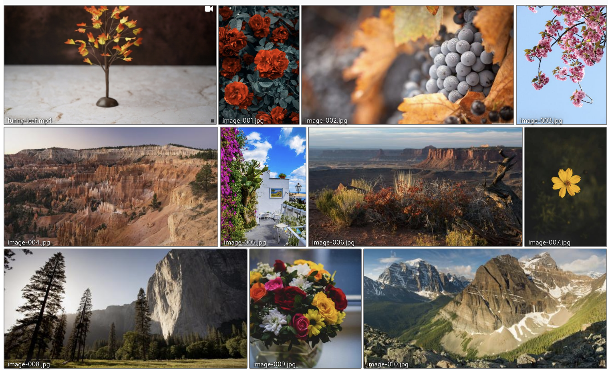
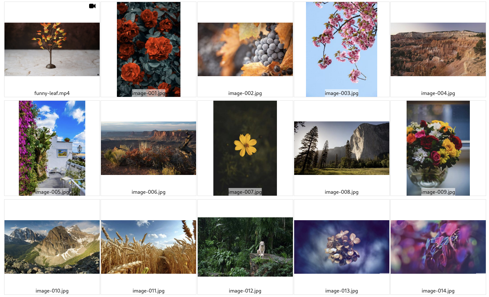
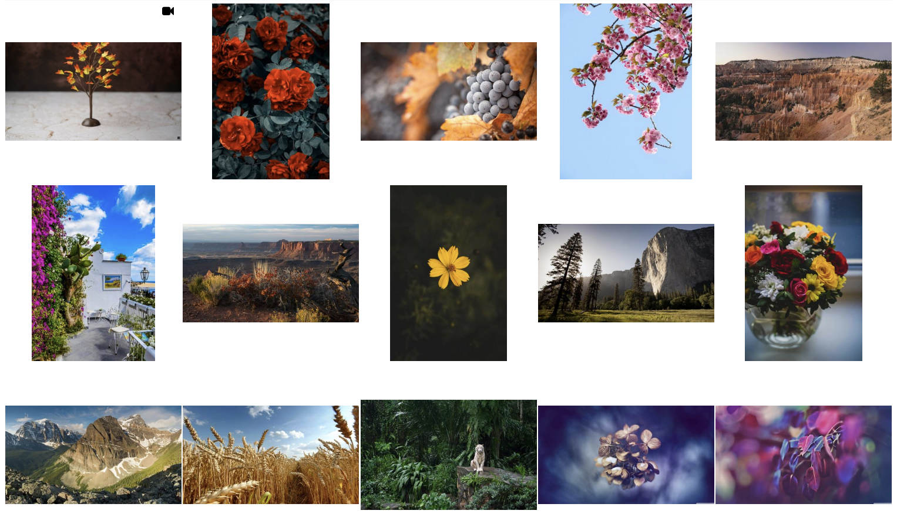
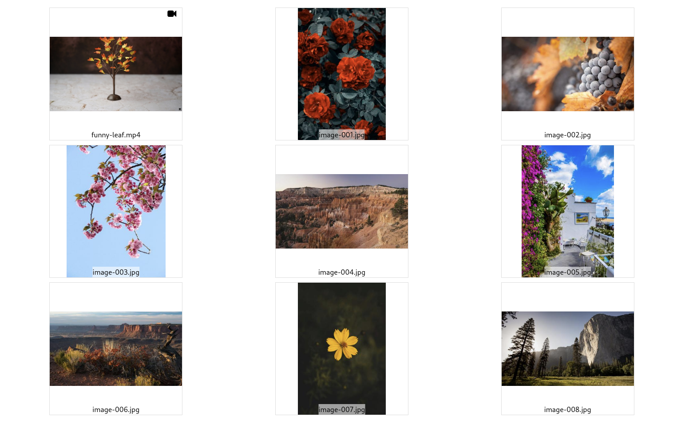

# Demo of gallerator

## The demos

In the following the `--name-of-gallery` argument was passed to every demo, but
that is optional. Without that argument, the galler would be named after the
base-name of the media source, or `media` in these cases. But for demo purposes,
we'd like to easily be able to distinguish them.

### Standard gallery

[Demo of standard gallery](standard-gallery/)

This is the gallery you get out of the box with just

<!-- gallery:Standard -->
```
gallerator --name-of-gallery Standard --gallery standard-gallery media
```

By default a "justified" gallery is created where all image thumbnail have the
same height: `--height`, but the width can differ:



### Recursive gallery

[Demo of recursive gallery](recursive-gallery/)

Here the `--recursive` has been added, so:

<!-- gallery:Recursive -->
```
gallerator --name-of-gallery Gallery --gallery recursive-gallery media \
    --recursive
```

### Pagination gallery

[Demo of pagination gallery](pagination-gallery/)

Here the `--pagination 20` has been added, so there are maximum 20 images on
each "page" with the last page perhaps having fewer:

<!-- gallery:Pagination -->
```
gallerator --name-of-gallery Pagination --gallery pagination-gallery media \
    --pagination 20
```

### Auto-grid gallery

[Demo of auto-grid gallery](auto-grid-gallery/)

Here the `--auto-grid` has been added, resulting in a page where all thumbnails
are constrained within a container of width: `--width` and height: `--height`:

<!-- gallery:Auto grid -->
```
gallerator --name-of-gallery Auto-grid --gallery auto-grid-gallery media \
    --auto-grid
```



### Nameless auto-grid gallery

[Demo of nameless auto-grid gallery](nameless-auto-grid-gallery/)

Here both `--auto-grid` and `--no-filename-captions` have been added, resulting
in a page where all thumbnails are constrained within a container of width:
`--width` and height: `--height` but there are no file names. This currently
gives a cleaner look to the grid layouts.

<!-- gallery:Nameless auto-grid -->
```
gallerator --name-of-gallery "Nameless auto-grid" --gallery nameless-auto-grid-gallery media \
    --auto-grid --no-filename-captions
```



### Grid gallery

[Demo of 3x3 grid gallery](grid-gallery/)

Here a `--grid 3x3` has been added, resulting in a page 3 columns of 3 rows of
thumbnails are constrained within a container of width: `--width` and height:
`--height`:

<!-- gallery:3x3 Grid -->
```
gallerator --name-of-gallery "3x3 grid" --gallery grid-gallery media \
    --grid 3x3
```



This gives a predictable layout with constant amount of columns, but it is not
responsive, so it may not look great on mobile devices or on very wide screens.

## Usage

<!-- replace-section:usage -->
```
usage: gallerator [-h] [--name-of-gallery NAME_OF_GALLERY]
                  [--gallery-dir GALLERY_DIR] [--recursive]
                  [--pagination PAGINATION] [--renderer RENDERER]
                  [--justified] [--auto-grid] [--grid GRID] [--width WIDTH]
                  [--height HEIGHT] [--no-filename-captions]
                  source_dir

Create static thumbnail galleries

positional arguments:
  source_dir            The directory containing the source images and videos
                        over which we want to create a gallery.

options:
  -h, --help            show this help message and exit
  --name-of-gallery NAME_OF_GALLERY
                        The name of the gallery. Defaults the base name of the
                        'source_dir'. (default: None)
  --gallery-dir GALLERY_DIR, -g GALLERY_DIR
                        The directory in which to store the generated gallery.
                        Defaults to the same as the 'source_dir' containing
                        the images. Note that this directory should be "close"
                        to the `source_dir` since relative paths are used when
                        referencing source images from the gallery or you'll
                        get many '../' elements in the image paths. (default:
                        None)
  --recursive, -r       Whether to search for image and video files
                        recursively. (default: False)
  --pagination PAGINATION, -p PAGINATION
                        The maximum number of images per page. 0 means
                        unlimited. (default: 0)
  --renderer RENDERER   Which renderer to use to actually produce the output
                        galleries. At the moment, there are two built-in ones:
                        "PhotoSwipe" and "nanogallery2". Advanced: Other
                        values will be loaded as a module that is expected to
                        have a renderer() method that returns an instance of
                        gallerator.data_types.Renderer. That way you can
                        render the gallery exactly like you want. (default:
                        PhotoSwipe)

Photoswipe:
  These are the arguments for Photoswipe, the default renderer. Different
  renderers have different options, so try "--renderer name-of-renderer
  --help" to see options for other renderers.

  --justified           By default, Photoswipe uses a justified layout, but
                        this will create a grid layout. Try e.g. "--grid 4x5",
                        for 4 columns by 5 rows, but supply your own "XxY"
                        value to set your own grid layout. This will override
                        any --pagination value. Beware that this is not
                        responsive, so it will either be too wide on mobile or
                        too narrow for large desktop users, or both. (default:
                        False)
  --auto-grid           By default, Photoswipe uses a justified layout, but
                        this will create a grid layout. Try e.g. "--grid 4x5",
                        for 4 columns by 5 rows, but supply your own "XxY"
                        value to set your own grid layout. This will override
                        any --pagination value. Beware that this is not
                        responsive, so it will either be too wide on mobile or
                        too narrow for large desktop users, or both. (default:
                        False)
  --grid GRID           By default, Photoswipe uses a justified layout, but
                        this will create a grid layout. Try e.g. "--grid 4x5",
                        for 4 columns by 5 rows, but supply your own "XxY"
                        value to set your own grid layout. This will override
                        any --pagination value. Beware that this is not
                        responsive, so it will either be too wide on mobile or
                        too narrow for large desktop users, or both. (default:
                        None)
  --width WIDTH         The width of the thumbnails. Only used by --auto-grid
                        and --grid (default: 300)
  --height HEIGHT       The height of the thumbnails. (default: 300)
  --no-filename-captions
                        Don't add the filenames of the images as a caption in
                        the thumbnail gallery. This makes it look cleaner
                        (especially for --grid and --auto-grid), but less
                        information for the user. When the full image is shown
                        in a lightbox, the file name is always shown,
                        regardless of this setting. (default: False)
```
<!-- /replace-section:usage -->


## Origin of the media files

### `.jpg' images

The `.jpg` images files come from this [reddit
post](https://www.reddit.com/r/WQHD_Wallpaper/comments/5acl8z/my_1440p_and_4k_nature_wallpapers/)
and in turn from
[imgur](https://imgur.com/a/120-high-quality-nature-images-W9ewQ)

And a few portrait `*.jpg` files from:
https://www.pexels.com/search/nature/


### `.mp4` videos

Come from https://www.pexels.com/search/videos/

## Media post-processing

I have categorized them a little, reduced the file size with help from
[Efficient Image Resizing With ImageMagick — Smashing
Magazine](https://www.smashingmagazine.com/2015/06/efficient-image-resizing-with-imagemagick/):


```shell
find -iname '*.jpg' -exec mogrify -filter Triangle -define filter:support=2 \
    -thumbnail 1500 -unsharp 0.25x0.08+8.3+0.045 -dither None -posterize 136 \
    -quality 82 -define jpeg:fancy-upsampling=off \
    -define png:compression-filter=5 -define png:compression-level=9 \
    -define png:compression-strategy=1 -define png:exclude-chunk=all \
    -interlace none -colorspace sRGB \
    {} +
```

```
ls -1 | sort -V | tr '\n' '\0' | xargs -0 renumber-files --base image-
```
